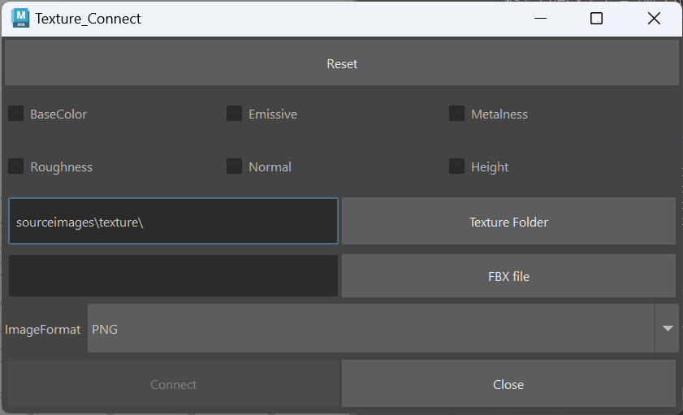

# texture-Connector

  
[English](README_EN.md)
## 概要
AdobeSubstancePainterで出力したテクスチャをMayaに簡単にアサインするツールです。
## 要件
[pymel](https://github.com/LumaPictures/pymel)
## 使い方
1.ドキュメントのmaya/使用バージョン/script内に.pyファイルを移動する。  
2.以下のコマンドを実行する。
```
import textureConnecter
textureConnecter.openwindow()
```
## 説明
1.Substance PainterでArnoldテンプレートを使用し、テクスチャを出力する。  
2.maya内でHypershade上でマテリアルを選択する。（マテリアル名を変更しないこと）  
3.画像ファイルの入っているフォルダを選択する。  
4.Substance Painterに使用したFBXを選択する。  
5.画像形式を選択する。  
6."Connect" ボタンで実行する。
## 作者
[Twitter](https://x.com/cotte_921)

## ライセンス
[MIT](LICENSE)
