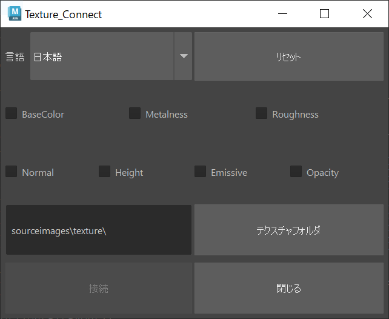

# texture-Connector on maya.cmd

  
[English](README_EN.md)
## 概要
AdobeSubstancePainterで出力したテクスチャをMayaに簡単にアサインするツールです。  
pymelが不要なバージョンです。
## 要件
なし
## 使い方
1.ドキュメントのmaya/使用バージョン/script内に.pyファイルを移動する。  
2.以下のコマンドを実行する。
```
import textureConnecter
textureConnecter.openWindow()
```  
またはscriptEditor上で直に実行する。
## 説明
1.Substance PainterでArnoldテンプレートを使用し、テクスチャを出力する。  
2.maya内でHypershade上でマテリアルを選択する。（マテリアル名を変更しないこと）  
3.画像ファイルの入っているフォルダを選択する。    
4."Connect" ボタンで実行する。
## 作者
[Twitter](https://x.com/cotte_921)

## ライセンス
[MIT](LICENSE)
